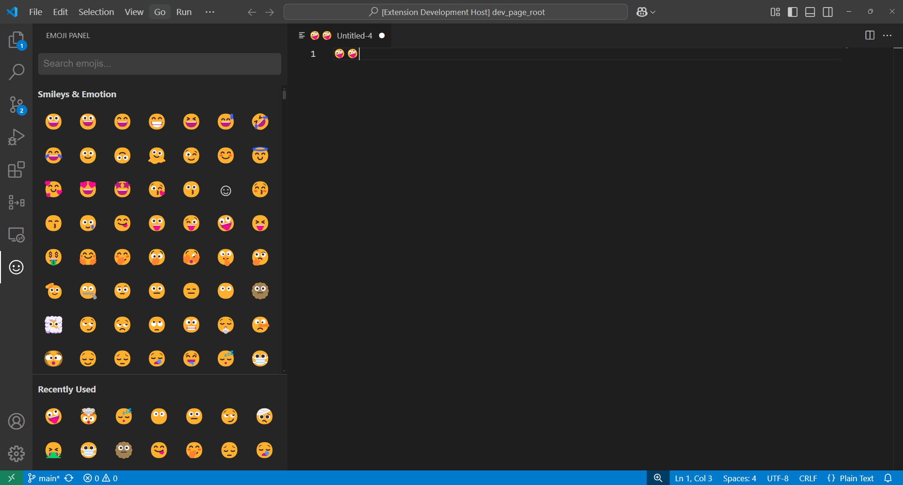

# VS Code Emoji Picker

A sleek and efficient emoji picker extension for Visual Studio Code that helps you quickly insert emojis into your code, comments, or markdown files.

## Features

- 🔍 Fast emoji search with support for descriptions, aliases, and tags
- 📝 Recently used emojis section for quick access
- 🎯 Clean, VS Code-native interface
- ⚡ Smooth copy animations and feedback
- 🎨 Automatically matches your VS Code theme
- 📱 Full emoji catalog with categorized sections

## Usage

1. Click the emoji icon in the activity bar (side panel)
2. Search for emojis by description, category, or tags
3. Click an emoji to copy it to your clipboard
4. Paste the emoji wherever you need it!

You can also open the panel using:
- Command Palette (`Ctrl+Shift+P` or `Cmd+Shift+P`): "Show Emoji Panel"

Your recently used emojis will appear at the bottom of the panel for quick access.

## Requirements

No additional dependencies required. Just install and start using! 

## Extension Settings

This extension currently has no configurable settings.

## Known Issues

None reported yet! Please submit any issues on our GitHub repository.

## Release Notes

### 1.0.0

Initial release with core features:
- Full emoji catalog with categorized browsing
- Fast search functionality
- Recently used emojis section
- Smooth copy animations
- VS Code-native theming

---

## For more information

Enjoy using the VS Code Emoji Picker! 🎯
